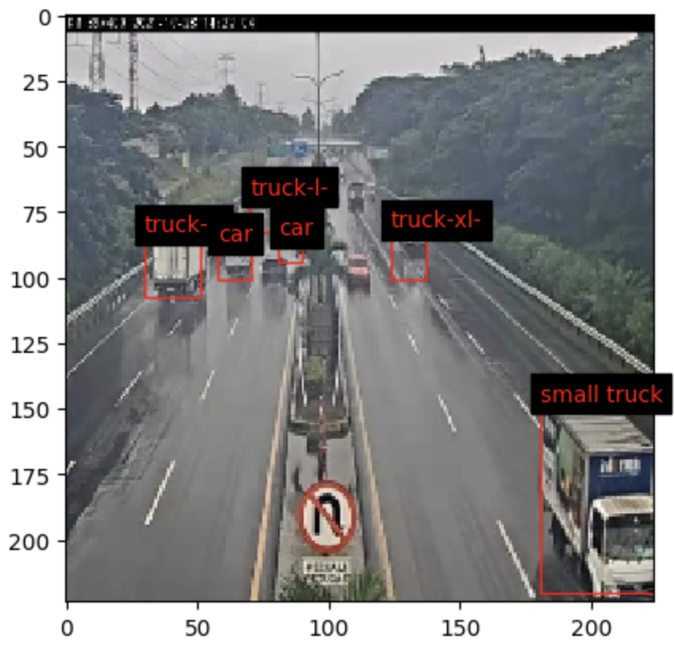

# YOLO-Traffic-ObjectDetection

This project is a custom implementation of the `YOLO` (You Only Look Once) model for object detection. The model was built from scratch using the ResNest50 backbone, which is a deep residual network with Squeeze-and-Excitation blocks. The model also has additional convolutional blocks to process the feature maps and generate the outputs. The outputs consist of the coordinates of the `bounding box (x1, x2, y1, y2)`, the `objectiveness score` (how confident the model is that there is an object in the box), and the `predicted classes` (what kind of object the model thinks it is).

The dataset used for training and testing the model was obtained from `Roboflow`, a platform that provides high-quality annotated images for computer vision tasks. The dataset contains images of various objects such as cars, trucks, etc. The images have a shape of `(224, 224)` pixels, and the annotations and output have a shape of `(1, 7, 7, 17)`, where 7 x 7 is the grid size and 17 is the number of channels (4 for bounding box, 1 for objectiveness score, and 12 for classes).

# Output examples:

# Used Libraries:
* Tensorflow (NN with GPU training and using pre-trained ResNet50)
* CV2 (image preparations)
* numpy
* matplotlib